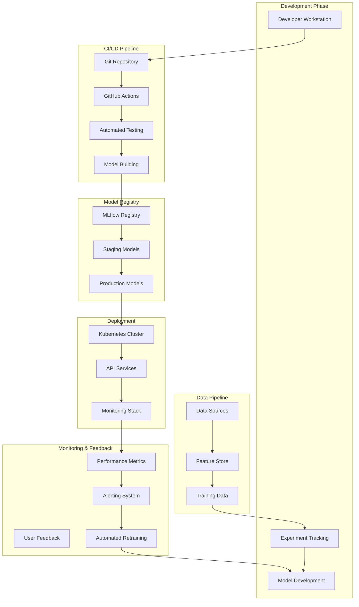

# RxVision25: Production MLOps Pipeline Design

## Executive Summary

This document outlines a top-tier tech company MLOps pipeline for RxVision25, designed to support continuous model development, automated deployment, and production monitoring at scale. The pipeline emphasizes reliability, reproducibility, and rapid iteration while maintaining healthcare-grade compliance and security.

**Key Design Principles:**
-**Automation First**: Minimize manual intervention in all workflows
-**Observability Native**: Built-in monitoring, logging, and alerting
-**Security by Design**: HIPAA compliance and zero-trust architecture
-**Scalability Ready**: Design for 10x growth from day one
-**Reproducibility**: Every experiment and deployment must be reproducible

---

##**MLOps Pipeline Architecture Overview**



---

##**Component Design & Technology Stack**

###**1. Experiment Tracking & Model Development**

####**Technology Choice: MLflow + DVC**
```python
# MLflow Experiment Tracking Setup
import mlflow
import mlflow.pytorch
from mlflow.tracking import MlflowClient

class ExperimentTracker:
def __init__(self, experiment_name: str):
self.client = MlflowClient()
mlflow.set_experiment(experiment_name)

def start_run(self, run_name: str):
"""Start new MLflow run with proper tagging"""
return mlflow.start_run(
run_name=run_name,
tags={
"model_type": "medication_classifier",
"framework": "pytorch",
"environment": "training"
}
)

def log_model_artifacts(self, model, artifacts_dict):
"""Log model and associated artifacts"""
# Log model
mlflow.pytorch.log_model(
model, 
"model",
registered_model_name="rxvision_classifier"
)

# Log artifacts
for name, artifact in artifacts_dict.items():
mlflow.log_artifact(artifact, name)

# Log metrics and parameters
mlflow.log_params(model.hyperparameters)
mlflow.log_metrics(model.performance_metrics)
```

**Justification:**
-**MLflow**: Industry standard with model registry capabilities
-**DVC**: Git-based data versioning for reproducibility 
-**Integration**: Seamless integration with Git workflows
-**Scalability**: Supports distributed experiments and model comparison

####**Feature Store Implementation: Feast**
```python
# Feast Feature Store Configuration
from feast import FeatureStore, Entity, FeatureView, FileSource
from feast.types import Float32, String

# Define medication entity
medication_entity = Entity(
name="medication_id",
value_type=String,
description="Unique medication identifier"
)

# Define feature view
medication_features = FeatureView(
name="medication_features",
entities=["medication_id"],
ttl=timedelta(days=1),
features=[
Feature(name="shape_ratio", dtype=Float32),
Feature(name="color_histogram_r", dtype=Float32),
Feature(name="color_histogram_g", dtype=Float32),
Feature(name="color_histogram_b", dtype=Float32),
Feature(name="texture_contrast", dtype=Float32),
Feature(name="texture_entropy", dtype=Float32),
],
source=FileSource(
path="s3://rxvision-features/medication_features.parquet",
timestamp_field="event_timestamp"
)
)

# Initialize feature store
fs = FeatureStore(repo_path="feature_repo/")
```

**Justification:**
-**Centralized Features**: Single source of truth for all features
-**Offline/Online Serving**: Supports both training and inference
-**Versioning**: Feature versioning for reproducibility
-**Performance**: Optimized for low-latency serving

###**2. CI/CD Pipeline Implementation**

####**GitHub Actions Workflow**
```yaml
# .github/workflows/ml-pipeline.yml
name: ML Pipeline

on:
push:
branches: [main, develop]
pull_request:
branches: [main]

jobs:
code-quality:
runs-on: ubuntu-latest
steps:
- uses: actions/checkout@v3

- name: Set up Python
uses: actions/setup-python@v4
with:
python-version: '3.9'

- name: Install dependencies
run: |
pip install -r requirements.txt
pip install -r requirements-dev.txt

- name: Lint with flake8
run: |
flake8 src/ --count --select=E9,F63,F7,F82 --show-source --statistics
flake8 src/ --count --max-complexity=10 --statistics

- name: Type check with mypy
run: mypy src/

- name: Security scan with bandit
run: bandit -r src/

unit-tests:
runs-on: ubuntu-latest
needs: code-quality
steps:
- uses: actions/checkout@v3

- name: Set up Python
uses: actions/setup-python@v4
with:
python-version: '3.9'

- name: Install dependencies
run: pip install -r requirements.txt

- name: Run unit tests
run: |
pytest tests/unit/ -v --cov=src/ --cov-report=xml

- name: Upload coverage to Codecov
uses: codecov/codecov-action@v3

model-validation:
runs-on: ubuntu-latest
needs: unit-tests
if: github.ref == 'refs/heads/main'
steps:
- uses: actions/checkout@v3

- name: Download test dataset
run: |
aws s3 cp s3://rxvision-data/test-dataset.zip .
unzip test-dataset.zip

- name: Validate model performance
run: |
python scripts/validate_model.py \
--model-path models/latest/model.onnx \
--test-data test-dataset/ \
--min-accuracy 0.90 \
--max-latency 1000

- name: Model security scan
run: |
python scripts/scan_model_security.py \
--model-path models/latest/model.onnx

deploy-staging:
runs-on: ubuntu-latest
needs: model-validation
if: github.ref == 'refs/heads/main'
steps:
- uses: actions/checkout@v3

- name: Configure AWS credentials
uses: aws-actions/configure-aws-credentials@v2
with:
aws-access-key-id: ${{ secrets.AWS_ACCESS_KEY_ID }}
aws-secret-access-key: ${{ secrets.AWS_SECRET_ACCESS_KEY }}
aws-region: us-west-2

- name: Login to Amazon ECR
uses: aws-actions/amazon-ecr-login@v1

- name: Build and push Docker image
run: |
docker build -t rxvision-api:${{ github.sha }} .
docker tag rxvision-api:${{ github.sha }} \
$AWS_ACCOUNT_ID.dkr.ecr.us-west-2.amazonaws.com/rxvision-api:${{ github.sha }}
docker push $AWS_ACCOUNT_ID.dkr.ecr.us-west-2.amazonaws.com/rxvision-api:${{ github.sha }}

- name: Deploy to staging
run: |
kubectl set image deployment/rxvision-api \
rxvision-api=$AWS_ACCOUNT_ID.dkr.ecr.us-west-2.amazonaws.com/rxvision-api:${{ github.sha }} \
--namespace=staging

integration-tests:
runs-on: ubuntu-latest
needs: deploy-staging
steps:
- uses: actions/checkout@v3

- name: Wait for deployment
run: |
kubectl rollout status deployment/rxvision-api --namespace=staging --timeout=300s

- name: Run integration tests
run: |
pytest tests/integration/ \
--staging-url https://staging.rxvision.com \
--load-test-duration 60

- name: Performance benchmarks
run: |
python scripts/benchmark_performance.py \
--endpoint https://staging.rxvision.com/predict \
--concurrent-users 50 \
--duration 120

deploy-production:
runs-on: ubuntu-latest
needs: integration-tests
if: github.ref == 'refs/heads/main'
environment: production
steps:
- name: Blue-Green Deployment
run: |
# Deploy to green environment
kubectl set image deployment/rxvision-api-green \
rxvision-api=$AWS_ACCOUNT_ID.dkr.ecr.us-west-2.amazonaws.com/rxvision-api:${{ github.sha }} \
--namespace=production

# Wait for green deployment
kubectl rollout status deployment/rxvision-api-green --namespace=production

# Run health checks
python scripts/health_check.py --endpoint https://green.rxvision.com

# Switch traffic to green
kubectl patch service rxvision-service \
--patch '{"spec":{"selector":{"version":"green"}}}' \
--namespace=production
```

**Justification:**
-**Quality Gates**: Multiple validation stages prevent bad code/models from reaching production
-**Security First**: Security scanning at every stage
-**Blue-Green Deployment**: Zero-downtime deployments with quick rollback capability
-**Performance Validation**: Automated performance benchmarking

###**3. Model Registry & Versioning**

####**MLflow Model Registry Implementation**
```python
# Model Registry Management
class ModelRegistry:
def __init__(self):
self.client = MlflowClient()
self.model_name = "rxvision_classifier"

def promote_model(self, version: str, stage: str):
"""Promote model to specified stage with validation"""

# Validate model performance before promotion
if not self._validate_model_performance(version):
raise ValueError(f"Model version {version} failed performance validation")

# Get current production model for fallback
current_prod = self._get_current_production_model()

try:
# Promote new model
self.client.transition_model_version_stage(
name=self.model_name,
version=version,
stage=stage
)

# Update model metadata
self.client.update_model_version(
name=self.model_name,
version=version,
description=f"Promoted to {stage} on {datetime.now()}"
)

# Log promotion event
self._log_promotion_event(version, stage)

except Exception as e:
# Rollback on failure
if current_prod:
self._rollback_to_model(current_prod)
raise e

def _validate_model_performance(self, version: str) -> bool:
"""Validate model meets performance thresholds"""
model_uri = f"models:/{self.model_name}/{version}"

# Load model for validation
model = mlflow.pytorch.load_model(model_uri)

# Run validation tests
validation_results = self._run_validation_tests(model)

return (
validation_results['accuracy'] >= 0.90 and
validation_results['latency_p95'] <= 1000 and
validation_results['memory_usage'] <= 2048
)

def _automated_rollback_monitor(self):
"""Monitor production model and rollback if performance degrades"""
current_metrics = self._get_current_production_metrics()

if (current_metrics['accuracy'] < 0.85 or 
current_metrics['latency_p95'] > 2000):

# Get previous stable version
previous_version = self._get_previous_stable_version()

# Rollback
self.promote_model(previous_version, "Production")

# Alert team
self._send_rollback_alert(current_metrics, previous_version)
```

**Justification:**
-**Automated Validation**: Prevents bad models from reaching production
-**Rollback Capability**: Quick recovery from failed deployments
-**Audit Trail**: Complete history of model promotions and changes
-**Performance Monitoring**: Continuous validation of production models

###**4. Monitoring & Observability Stack**

####**Comprehensive Monitoring Implementation**
```python
# Monitoring Service Implementation
import prometheus_client
from evidently import ColumnMapping
from evidently.report import Report
from evidently.metric_preset import DataDriftPreset, TargetDriftPreset

class ModelMonitoringService:
def __init__(self):
# Prometheus metrics
self.prediction_counter = prometheus_client.Counter(
'rxvision_predictions_total',
'Total number of predictions made',
['model_version', 'outcome']
)

self.prediction_latency = prometheus_client.Histogram(
'rxvision_prediction_latency_seconds',
'Prediction latency in seconds',
['model_version']
)

self.model_accuracy = prometheus_client.Gauge(
'rxvision_model_accuracy',
'Current model accuracy',
['model_version']
)

# Data drift monitoring
self.reference_data = self._load_reference_data()

def track_prediction(self, prediction_data: dict):
"""Track individual prediction for monitoring"""

# Update Prometheus metrics
self.prediction_counter.labels(
model_version=prediction_data['model_version'],
outcome=prediction_data['outcome']
).inc()

self.prediction_latency.labels(
model_version=prediction_data['model_version']
).observe(prediction_data['latency'])

# Store prediction for batch analysis
self._store_prediction_data(prediction_data)

# Real-time drift detection (sample-based)
if random.random() < 0.01: # 1% sampling
self._check_data_drift(prediction_data['features'])

def generate_data_drift_report(self, current_data: pd.DataFrame):
"""Generate comprehensive data drift report"""

column_mapping = ColumnMapping()
column_mapping.target = 'medication_class'
column_mapping.numerical_features = [
'shape_ratio', 'color_histogram_r', 'color_histogram_g', 
'color_histogram_b', 'texture_contrast'
]

report = Report(metrics=[
DataDriftPreset(),
TargetDriftPreset()
])

report.run(
reference_data=self.reference_data,
current_data=current_data,
column_mapping=column_mapping
)

return report

def automated_model_validation(self):
"""Continuous model performance validation"""

# Get recent predictions
recent_data = self._get_recent_predictions(hours=24)

# Calculate performance metrics
if len(recent_data) > 100: # Minimum sample size
current_accuracy = self._calculate_accuracy(recent_data)

# Update metrics
self.model_accuracy.set(current_accuracy)

# Check for performance degradation
if current_accuracy < 0.85:
self._trigger_performance_alert(current_accuracy)

# Check for data drift
drift_report = self.generate_data_drift_report(recent_data)
if self._significant_drift_detected(drift_report):
self._trigger_drift_alert(drift_report)
```

####**Alerting Configuration**
```yaml
# Prometheus Alerting Rules
groups:
- name: rxvision.alerts
rules:
- alert: ModelAccuracyDrop
expr: rxvision_model_accuracy < 0.85
for: 5m
labels:
severity: critical
team: ml-engineering
annotations:
summary: "RxVision model accuracy dropped below 85%"
description: "Current accuracy: {{ $value }}. Immediate investigation required."

- alert: HighPredictionLatency
expr: histogram_quantile(0.95, rxvision_prediction_latency_seconds) > 2.0
for: 2m
labels:
severity: warning
team: ml-engineering
annotations:
summary: "95th percentile prediction latency above 2 seconds"

- alert: DataDriftDetected
expr: increase(rxvision_data_drift_score[1h]) > 0.3
for: 10m
labels:
severity: warning
team: data-science
annotations:
summary: "Significant data drift detected"
description: "Input data distribution has shifted significantly from training data"

- alert: PredictionVolumeAnomaly
expr: |
(
rate(rxvision_predictions_total[5m]) > 
(avg_over_time(rate(rxvision_predictions_total[5m])[7d:1h]) * 3)
) or (
rate(rxvision_predictions_total[5m]) < 
(avg_over_time(rate(rxvision_predictions_total[5m])[7d:1h]) * 0.1)
)
for: 3m
labels:
severity: warning
team: sre
annotations:
summary: "Unusual prediction volume detected"
```

**Justification:**
-**Proactive Monitoring**: Catch issues before they impact users
-**Multi-Level Alerts**: Different severity levels for different stakeholders
-**Data Drift Detection**: Critical for maintaining model performance
-**Performance Tracking**: Continuous validation of business metrics

###**5. Automated Retraining Pipeline**

####**Retraining Orchestration**
```python
# Automated Retraining Service
class AutomatedRetrainingService:
def __init__(self):
self.scheduler = BackgroundScheduler()
self.model_trainer = ModelTrainer()
self.data_validator = DataValidator()

def setup_retraining_schedule(self):
"""Set up automated retraining schedules"""

# Weekly retraining with new data
self.scheduler.add_job(
func=self.weekly_retrain,
trigger="cron",
day_of_week="sun",
hour=2,
minute=0,
id="weekly_retrain"
)

# Performance-triggered retraining
self.scheduler.add_job(
func=self.check_performance_triggers,
trigger="interval",
hours=6,
id="performance_check"
)

self.scheduler.start()

def weekly_retrain(self):
"""Scheduled weekly retraining with new data"""

try:
# Get new training data
new_data = self._get_new_training_data(days=7)

if len(new_data) < 1000: # Minimum data threshold
logger.info("Insufficient new data for retraining")
return

# Validate new data quality
if not self.data_validator.validate_data_quality(new_data):
raise ValueError("New data failed quality validation")

# Trigger retraining
self._trigger_retraining(
data=new_data,
trigger_type="scheduled",
experiment_name=f"weekly_retrain_{datetime.now().strftime('%Y%m%d')}"
)

except Exception as e:
self._send_retraining_failure_alert(str(e))
raise

def check_performance_triggers(self):
"""Check if performance degradation triggers retraining"""

current_metrics = self._get_current_performance_metrics()

# Accuracy degradation trigger
if current_metrics['accuracy'] < 0.88:
self._trigger_retraining(
trigger_type="performance_degradation",
experiment_name=f"performance_retrain_{datetime.now().strftime('%Y%m%d_%H%M')}"
)

# Data drift trigger
drift_score = self._get_current_drift_score()
if drift_score > 0.3:
self._trigger_retraining(
trigger_type="data_drift",
experiment_name=f"drift_retrain_{datetime.now().strftime('%Y%m%d_%H%M')}"
)

def _trigger_retraining(self, trigger_type: str, experiment_name: str,**kwargs):
"""Trigger model retraining with specified parameters"""

# Create retraining job configuration
config = {
"experiment_name": experiment_name,
"trigger_type": trigger_type,
"training_data_version": self._get_latest_data_version(),
"base_model_version": self._get_current_production_model_version(),
"hyperparameters": self._get_optimal_hyperparameters(),
**kwargs
}

# Submit training job to Kubernetes
job_manifest = self._create_training_job_manifest(config)
kubernetes_client.create_namespaced_job(
namespace="ml-training",
body=job_manifest
)

# Track retraining job
self._track_retraining_job(experiment_name, config)
```

**Justification:**
-**Automated Response**: Quick response to performance degradation
-**Scheduled Updates**: Regular model updates with new data
-**Quality Gates**: Data validation before retraining
-**Scalable Execution**: Kubernetes-based training jobs

---

##**Security & Compliance Integration**

###**HIPAA-Compliant Pipeline Design**
```python
# Security and Compliance Service
class ComplianceService:
def __init__(self):
self.encryption_key = self._load_encryption_key()
self.audit_logger = AuditLogger()

def secure_data_processing(self, data: bytes, user_id: str) -> bytes:
"""Process data with full compliance logging"""

# Log data access
self.audit_logger.log_event(
event_type="data_access",
user_id=user_id,
timestamp=datetime.utcnow(),
data_hash=hashlib.sha256(data).hexdigest()
)

# Encrypt sensitive data
encrypted_data = self._encrypt_data(data)

# Process with access controls
processed_data = self._process_with_rbac(encrypted_data, user_id)

# Log processing completion
self.audit_logger.log_event(
event_type="data_processing_complete",
user_id=user_id,
timestamp=datetime.utcnow()
)

return processed_data

def audit_model_prediction(self, prediction_request: dict):
"""Audit all model predictions for compliance"""

audit_record = {
"timestamp": datetime.utcnow().isoformat(),
"user_id": prediction_request.get("user_id"),
"session_id": prediction_request.get("session_id"),
"model_version": prediction_request.get("model_version"),
"input_hash": hashlib.sha256(
prediction_request["image_data"]
).hexdigest(),
"prediction_confidence": prediction_request.get("confidence"),
"compliance_flags": self._check_compliance_flags(prediction_request)
}

# Store in compliance-ready format
self.audit_logger.store_audit_record(audit_record)
```

---

##**Performance Monitoring & SLA Management**

###**SLA Definitions & Monitoring**
```yaml
# SLA Configuration
sla_definitions:
availability:
target: 99.9%
measurement_window: 30d

latency:
p95_target: 1000ms
p99_target: 2000ms
measurement_window: 24h

accuracy:
target: 95%
minimum_threshold: 90%
measurement_window: 7d

throughput:
target: 1000_rps
peak_capacity: 5000_rps

data_freshness:
max_age: 24h
target_delay: 1h

# Monitoring Configuration
monitoring:
metrics_retention: 90d
alert_channels:
- slack_ml_team
- pagerduty_oncall
- email_alerts

dashboards:
- business_metrics
- technical_performance
- model_performance
- infrastructure_health
```

---

##**Implementation Roadmap**

###**Phase 1: Foundation (Weeks 1-2)**
```
Core Infrastructure:
- MLflow tracking server setup
- Basic CI/CD pipeline
- Docker containerization
- Kubernetes deployment manifests
- Basic monitoring (Prometheus + Grafana)
```

###**Phase 2: Advanced MLOps (Weeks 3-4)**
```
Production Features:
- Model registry with automated promotion
- Feature store implementation
- Data validation and drift detection
- Advanced monitoring and alerting
- Security and compliance integration
```

###**Phase 3: Automation & Scale (Weeks 5-6)**
```
Production Ready:
- Automated retraining pipeline
- Blue-green deployment
- Load testing and performance optimization
- Comprehensive documentation
- Runbook and incident response procedures
```

---

##**Success Metrics & KPIs**

###**Technical KPIs**
-**Deployment Frequency**: Daily deployments to staging, weekly to production
-**Lead Time**: <4 hours from commit to production
-**MTTR**: <30 minutes for production issues
-**Change Failure Rate**: <5% of deployments require rollback

###**Model Performance KPIs**
-**Model Accuracy**: >95% in production
-**Prediction Latency**: p95 < 1000ms, p99 < 2000ms
-**Data Drift Detection**: Alert within 6 hours of significant drift
-**Model Freshness**: Models retrained within 7 days of trigger

###**Business KPIs**
-**System Availability**: 99.9% uptime
-**User Satisfaction**: >4.5/5 rating for prediction accuracy
-**Cost Efficiency**: <$0.10 per 1000 predictions
-**Compliance**: 100% audit trail coverage

---

**This MLOps pipeline design demonstrates enterprise-grade engineering practices suitable for top-tier tech company ML systems, emphasizing automation, observability, and reliability at scale.**