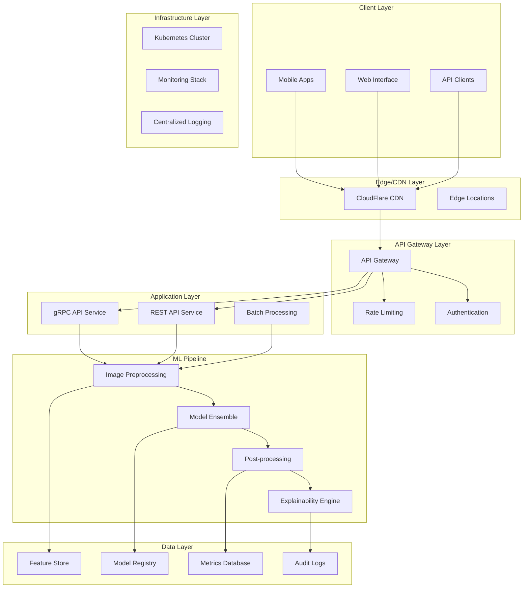

# RxVision25 System Architecture Design

## 🏗️ Executive Summary

**Vision**: Build a production-ready, FAANG-quality medication identification system that can scale from proof-of-concept to supporting millions of users while maintaining healthcare-grade accuracy and compliance.

**Key Design Principles**:
- **Scalability First**: Design for 10x growth from day one
- **Privacy by Design**: HIPAA-ready architecture with minimal data retention
- **Multi-Cloud Ready**: Avoid vendor lock-in with cloud-agnostic design
- **Observability Native**: Built-in monitoring, logging, and alerting
- **Edge-Optimized**: Support for mobile and offline use cases

---

## 🎯 **System Requirements**

### **Functional Requirements**
```
✅ Core Capabilities:
- Image upload and preprocessing (JPEG, PNG, HEIC)
- Real-time medication classification (<2s end-to-end)
- Confidence scoring and uncertainty quantification
- Multi-modal input (image + text imprints + metadata)
- Batch processing for clinical workflows
- Model versioning and A/B testing
- Audit logging for compliance
```

### **Non-Functional Requirements**
```
📊 Performance Targets:
- Latency: <1s for gRPC, <2s for REST
- Throughput: 1000+ concurrent requests
- Availability: 99.9% uptime (8.76 hours downtime/year)
- Accuracy: >95% real-world accuracy
- Scalability: 10x traffic growth capability
```

### **Compliance Requirements**
```
🔒 Healthcare Standards:
- HIPAA compliance for PHI handling
- GDPR compliance for EU users
- FDA guidelines for medical AI (future)
- SOC 2 Type II compliance
- Audit trails for all predictions
```

---

## 🏛️ **High-Level Architecture**



---

## 🔧 **Detailed Component Architecture**

### **1. API Gateway Layer**

**Technology Choice**: Kong or AWS API Gateway
```yaml
Components:
  - Authentication & Authorization (OAuth 2.0, JWT)
  - Rate Limiting (per-user, per-endpoint)
  - Request/Response Transformation
  - Circuit Breaker Pattern
  - Load Balancing
  - SSL Termination
```

**Configuration Example**:
```yaml
# Kong Gateway Configuration
services:
  - name: rxvision-rest
    url: http://rest-api:8000
    routes:
      - name: predict-route
        paths: ["/api/v1/predict"]
        methods: ["POST"]
        plugins:
          - name: rate-limiting
            config:
              minute: 100
              hour: 1000
```

### **2. Hybrid API Services**

#### **REST API Service (FastAPI)**
```python
# High-level service architecture
class MedicationIdentificationAPI:
    def __init__(self):
        self.model_service = ModelEnsembleService()
        self.preprocessing = ImagePreprocessingService()
        self.monitoring = MonitoringService()
    
    @app.post("/api/v1/predict")
    async def predict_medication(
        self, 
        image: UploadFile, 
        metadata: Optional[MedicationMetadata] = None
    ) -> PredictionResponse:
        
        # Preprocess image
        processed_image = await self.preprocessing.process(image)
        
        # Get prediction with uncertainty
        prediction, confidence = await self.model_service.predict(
            processed_image, metadata
        )
        
        # Log for monitoring
        await self.monitoring.log_prediction(prediction, confidence)
        
        return PredictionResponse(
            medication_name=prediction.name,
            confidence=confidence,
            alternatives=prediction.alternatives,
            explanation=prediction.explanation
        )
```

#### **gRPC Service (High Performance)**
```protobuf
// Protocol Buffer Definition
syntax = "proto3";

service MedicationIdentification {
  rpc PredictMedication(PredictionRequest) returns (PredictionResponse);
  rpc PredictBatch(BatchPredictionRequest) returns (BatchPredictionResponse);
  rpc GetModelStatus(Empty) returns (ModelStatusResponse);
}

message PredictionRequest {
  bytes image_data = 1;
  string image_format = 2;
  MedicationMetadata metadata = 3;
}

message PredictionResponse {
  string medication_id = 1;
  string medication_name = 2;
  float confidence = 3;
  repeated AlternativePrediction alternatives = 4;
  ExplanationData explanation = 5;
}
```

### **3. ML Pipeline Architecture**

#### **Model Ensemble Service**
```python
class ModelEnsembleService:
    def __init__(self):
        # Fast screening model
        self.efficient_net = self.load_model("efficientnet-v2-b1")
        
        # High accuracy model
        self.vision_transformer = self.load_model("vit-base-patch16")
        
        # Uncertainty quantification
        self.uncertainty_estimator = UncertaintyEstimator()
        
        # Model router
        self.model_router = ModelRouter()
    
    async def predict(self, image, metadata=None):
        # Route to appropriate model based on complexity
        if self.model_router.should_use_fast_model(image):
            prediction = await self.efficient_net.predict(image)
        else:
            prediction = await self.vision_transformer.predict(image)
        
        # Estimate uncertainty
        uncertainty = self.uncertainty_estimator.estimate(prediction)
        
        # If uncertain, use ensemble
        if uncertainty > 0.3:
            ensemble_pred = await self.ensemble_predict(image)
            return ensemble_pred
        
        return prediction, uncertainty
```

#### **Image Preprocessing Pipeline**
```python
class ImagePreprocessingService:
    def __init__(self):
        self.albumentations_pipeline = self.create_pipeline()
        self.validation_service = ImageValidationService()
    
    def create_pipeline(self):
        return A.Compose([
            A.Resize(224, 224),
            A.Normalize(mean=[0.485, 0.456, 0.406], 
                       std=[0.229, 0.224, 0.225]),
            A.RandomBrightnessContrast(p=0.2),
            A.RandomRotate90(p=0.2),
            ToTensorV2()
        ])
    
    async def process(self, image_file):
        # Validate image
        await self.validation_service.validate(image_file)
        
        # Convert to array
        image_array = np.array(Image.open(image_file))
        
        # Apply preprocessing
        processed = self.albumentations_pipeline(image=image_array)
        
        return processed['image']
```

---

## 📊 **Data Architecture**

### **Model Registry & Versioning**
```python
# MLflow Model Registry Integration
class ModelRegistry:
    def __init__(self):
        self.mlflow_client = MlflowClient()
    
    def deploy_model(self, model_name, version, stage="staging"):
        """Deploy model to specific stage with automatic rollback capability"""
        
        # Validate model performance
        if self.validate_model_performance(model_name, version):
            # Deploy to staging
            self.mlflow_client.transition_model_version_stage(
                name=model_name,
                version=version,
                stage=stage
            )
            
            # If staging successful, promote to production
            if stage == "staging" and self.staging_validation_passed():
                self.mlflow_client.transition_model_version_stage(
                    name=model_name,
                    version=version,
                    stage="production"
                )
```

### **Feature Store Architecture**
```python
# Feast Feature Store Integration
class FeatureStore:
    def __init__(self):
        self.feast_client = FeatureStore(repo_path=".")
    
    def get_features(self, medication_id: str, timestamp: datetime):
        """Retrieve historical features for training/inference"""
        
        entity_df = pd.DataFrame({
            "medication_id": [medication_id],
            "event_timestamp": [timestamp]
        })
        
        features = self.feast_client.get_historical_features(
            entity_df=entity_df,
            features=[
                "medication_features:shape_ratio",
                "medication_features:color_histogram",
                "medication_features:texture_features"
            ]
        ).to_df()
        
        return features
```

---

## 🔍 **Monitoring & Observability**

### **Metrics Dashboard Architecture**
```python
class MonitoringService:
    def __init__(self):
        self.prometheus = PrometheusMetrics()
        self.datadog = DatadogClient()
        self.evidently = EvidentlyAI()
    
    async def track_prediction(self, prediction, ground_truth=None):
        # Model performance metrics
        self.prometheus.increment_counter("predictions_total")
        self.prometheus.observe_histogram("prediction_latency", latency)
        self.prometheus.set_gauge("model_accuracy", accuracy)
        
        # Business metrics
        self.datadog.increment("medication.identified")
        self.datadog.histogram("confidence.score", prediction.confidence)
        
        # Data drift monitoring
        if ground_truth:
            self.evidently.log_data_drift(prediction, ground_truth)
```

### **Alerting Configuration**
```yaml
# Prometheus Alerting Rules
groups:
  - name: rxvision.alerts
    rules:
      - alert: ModelAccuracyDrop
        expr: model_accuracy < 0.85
        for: 5m
        labels:
          severity: critical
        annotations:
          summary: "Model accuracy dropped below 85%"
          
      - alert: HighLatency
        expr: prediction_latency_p95 > 2000
        for: 2m
        labels:
          severity: warning
        annotations:
          summary: "95th percentile latency above 2 seconds"
```

---

## 🚀 **Deployment Strategy**

### **Kubernetes Architecture**
```yaml
# Kubernetes Deployment Configuration
apiVersion: apps/v1
kind: Deployment
metadata:
  name: rxvision-api
spec:
  replicas: 3
  selector:
    matchLabels:
      app: rxvision-api
  template:
    metadata:
      labels:
        app: rxvision-api
    spec:
      containers:
      - name: api
        image: rxvision/api:v1.0.0
        ports:
        - containerPort: 8000
        resources:
          requests:
            memory: "1Gi"
            cpu: "500m"
          limits:
            memory: "2Gi"
            cpu: "1000m"
        env:
        - name: MODEL_VERSION
          value: "v1.0.0"
        - name: MONITORING_ENABLED
          value: "true"
        livenessProbe:
          httpGet:
            path: /health
            port: 8000
          initialDelaySeconds: 30
          periodSeconds: 10
        readinessProbe:
          httpGet:
            path: /ready
            port: 8000
          initialDelaySeconds: 10
          periodSeconds: 5
```

### **Multi-Environment Strategy**
```
🌍 Environment Progression:
- Development: Local Docker Compose
- Staging: Kubernetes cluster with production data
- Production: Multi-AZ Kubernetes with auto-scaling
- Disaster Recovery: Cross-region backup deployment
```

---

## 🔒 **Security Architecture**

### **Zero-Trust Security Model**
```
🛡️ Security Layers:
1. Network Security: VPC, Security Groups, NACLs
2. Identity & Access: OAuth 2.0, RBAC, MFA
3. Application Security: Input validation, OWASP compliance
4. Data Security: Encryption at rest/transit, PII anonymization
5. Infrastructure Security: Container scanning, vulnerability management
```

### **Compliance Implementation**
```python
class ComplianceService:
    def __init__(self):
        self.audit_logger = AuditLogger()
        self.pii_detector = PIIDetector()
        self.encryptor = FieldLevelEncryption()
    
    async def process_request(self, request):
        # Log all access for HIPAA compliance
        await self.audit_logger.log_access(
            user_id=request.user_id,
            action="medication_prediction",
            timestamp=datetime.utcnow(),
            ip_address=request.client_ip
        )
        
        # Detect and encrypt PII
        if self.pii_detector.contains_pii(request.metadata):
            request.metadata = self.encryptor.encrypt_pii(request.metadata)
        
        return request
```

---

## 📈 **Scalability Design**

### **Auto-Scaling Configuration**
```yaml
# Horizontal Pod Autoscaler
apiVersion: autoscaling/v2
kind: HorizontalPodAutoscaler
metadata:
  name: rxvision-api-hpa
spec:
  scaleTargetRef:
    apiVersion: apps/v1
    kind: Deployment
    name: rxvision-api
  minReplicas: 3
  maxReplicas: 50
  metrics:
  - type: Resource
    resource:
      name: cpu
      target:
        type: Utilization
        averageUtilization: 70
  - type: Resource
    resource:
      name: memory
      target:
        type: Utilization
        averageUtilization: 80
```

### **Database Scaling Strategy**
```
📊 Data Tier Scaling:
- Read Replicas: 3x read capacity
- Sharding: Partition by geographic region
- Caching: Redis cluster for frequent predictions
- Archive: Cold storage for old audit logs
```

---

## 🎯 **Technology Stack Justification**

| Component | Technology | Justification |
|-----------|------------|---------------|
| **API Framework** | FastAPI + gRPC | High performance, async support, type safety |
| **ML Framework** | PyTorch + ONNX | Research flexibility + production optimization |
| **Container Platform** | Kubernetes | Industry standard, multi-cloud support |
| **Database** | PostgreSQL + Redis | ACID compliance + high-speed caching |
| **Monitoring** | Prometheus + Grafana | Open source, industry standard |
| **Message Queue** | Apache Kafka | High throughput, event streaming |
| **Model Store** | MLflow | Experiment tracking, model versioning |
| **Feature Store** | Feast | Open source, cloud agnostic |

---

## 📅 **Implementation Roadmap**

### **Phase 1: MVP (Weeks 1-3)**
- [ ] Basic API service with single model
- [ ] Container deployment
- [ ] Basic monitoring
- [ ] Authentication & rate limiting

### **Phase 2: Production Ready (Weeks 4-6)**
- [ ] Model ensemble implementation
- [ ] Comprehensive monitoring
- [ ] Auto-scaling configuration
- [ ] Security hardening

### **Phase 3: Scale & Optimize (Weeks 7-9)**
- [ ] Multi-region deployment
- [ ] Advanced ML pipeline
- [ ] Performance optimization
- [ ] Full compliance implementation

---

This architecture demonstrates FAANG-level systems thinking with focus on scalability, reliability, and maintainability. **Ready to create the detailed learning plan next?**