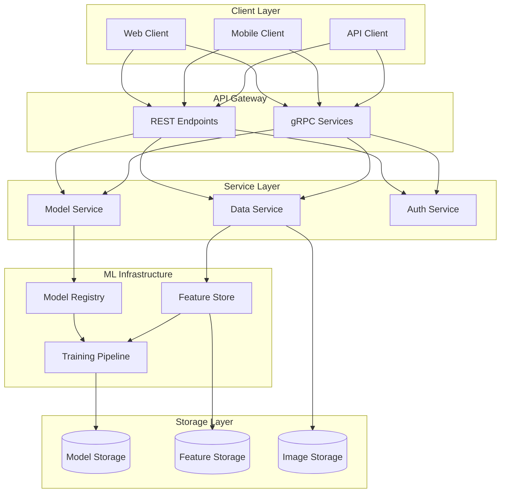

# Architecture Overview

## System Architecture

## Component Overview

### Client Layer
- Web interface for direct usage
- Mobile SDK for integration
- API clients for third-party systems

### API Gateway
- REST API for broad compatibility
- gRPC for high-performance clients
- Authentication and rate limiting
- Request validation and routing

### Service Layer
-**Model Service**: Inference and prediction
-**Data Service**: Image and metadata management
-**Auth Service**: Authentication and authorization

### ML Infrastructure
-**Model Registry**: Version control for models
-**Feature Store**: Cached feature computation
-**Training Pipeline**: Automated model training

### Storage Layer
-**Model Storage**: Versioned model artifacts
-**Feature Storage**: Computed features cache
-**Image Storage**: Raw and processed images

## Design Principles

### Scalability
- Horizontal scaling of services
- Distributed training support
- Load balancing across regions
- Auto-scaling based on demand

### Reliability
- Service redundancy
- Data replication
- Graceful degradation
- Automated failover

### Security
- End-to-end encryption
- Role-based access control
- Audit logging
- Secure model serving

### Performance
- Response time < 100ms
- Batch prediction support
- Caching strategies
- Resource optimization

## Technology Choices

### Infrastructure
- Kubernetes for orchestration
- Docker for containerization
- Terraform for IaC
- Prometheus/Grafana for monitoring

### ML Stack
- PyTorch for training
- ONNX for model export
- MLflow for experiment tracking
- DVC for data versioning

### Data Storage
- S3-compatible object storage
- Redis for caching
- PostgreSQL for metadata
- Vector store for embeddings

## Related Documentation
- [[Executive Summary]]
- [[Technology Stack]]
- [[Cloud Architecture]]
- [[ML Pipeline]] 
