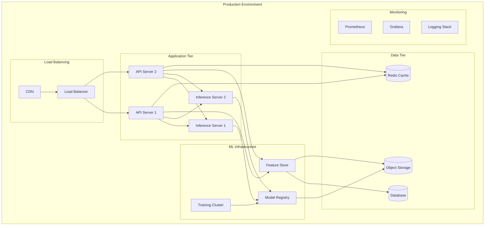

# Cloud Architecture

## Infrastructure Overview



## Infrastructure as Code

### Terraform Structure
```hcl
# main.tf
module "networking" {
source = "./modules/networking"
vpc_cidr = "10.0.0.0/16"
environment = var.environment
}

module "kubernetes" {
source = "./modules/kubernetes"
vpc_id = module.networking.vpc_id
cluster_name = "rxvision-${var.environment}"
}

module "storage" {
source = "./modules/storage"
environment = var.environment
}
```

### Kubernetes Resources
```yaml
# deployment.yaml
apiVersion: apps/v1
kind: Deployment
metadata:
name: rxvision-api
spec:
replicas: 3
strategy:
type: RollingUpdate
template:
spec:
containers:
- name: api
image: rxvision/api:latest
resources:
limits:
cpu: "2"
memory: "4Gi"
requests:
cpu: "1"
memory: "2Gi"
```

## Scaling Strategy

### Horizontal Pod Autoscaling
```yaml
apiVersion: autoscaling/v2
kind: HorizontalPodAutoscaler
metadata:
name: rxvision-inference
spec:
scaleTargetRef:
apiVersion: apps/v1
kind: Deployment
name: rxvision-inference
minReplicas: 2
maxReplicas: 10
metrics:
- type: Resource
resource:
name: cpu
target:
type: Utilization
averageUtilization: 70
```

### GPU Node Management
```yaml
apiVersion: scheduling.k8s.io/v1
kind: PriorityClass
metadata:
name: gpu-priority
value: 1000000
globalDefault: false
description: "Priority class for GPU workloads"
```

## Security Architecture

### Network Security
- VPC isolation
- Security groups
- Network policies
- TLS everywhere

### Access Control
```yaml
apiVersion: rbac.authorization.k8s.io/v1
kind: Role
metadata:
name: model-deployer
rules:
- apiGroups: [""]
resources: ["pods", "services"]
verbs: ["get", "list", "watch", "create", "update", "patch", "delete"]
```

### Secret Management
```yaml
apiVersion: v1
kind: Secret
metadata:
name: ml-credentials
type: Opaque
stringData:
mlflow-tracking-uri: "https://mlflow.internal"
model-registry-key: "${MODEL_REGISTRY_KEY}"
```

## Monitoring & Observability

### Prometheus Configuration
```yaml
apiVersion: monitoring.coreos.com/v1
kind: ServiceMonitor
metadata:
name: rxvision-metrics
spec:
endpoints:
- port: metrics
interval: 15s
selector:
matchLabels:
app: rxvision
```

### Logging Pipeline
```yaml
apiVersion: logging.banzaicloud.io/v1beta1
kind: Flow
metadata:
name: rxvision-logs
spec:
filters:
- parser:
remove_key_name_field: true
parse:
type: json
match:
- select:
labels:
app: rxvision
```

## Cost Optimization

### Resource Quotas
```yaml
apiVersion: v1
kind: ResourceQuota
metadata:
name: compute-resources
spec:
hard:
requests.cpu: "20"
requests.memory: 40Gi
limits.cpu: "40"
limits.memory: 80Gi
```

### Spot Instances
- Training workloads
- Non-critical services
- Batch processing

## Disaster Recovery

### Backup Strategy
- Database snapshots
- Model artifacts
- Configuration backups
- Cross-region replication

### Recovery Procedures
1. Infrastructure restoration
2. Data recovery
3. Service validation
4. Traffic migration

## Related Documentation
- [[Architecture Overview]]
- [[Deployment Guide]]
- [[Security Guidelines]]
- [[Monitoring Setup]] 