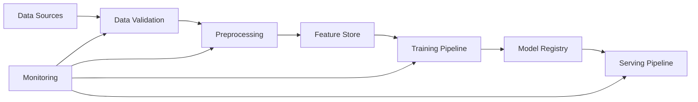

# ML Pipeline

## System Overview

### Pipeline Architecture


## Data Management

### Data Versioning
- DVC for dataset versioning
- S3-compatible storage backend
- Immutable data snapshots
- Reproducible pipelines

### Quality Controls
```python
class DataValidator:
    def validate_dataset(self, data_path: Path) -> ValidationResult:
        """
        Validates dataset against production criteria:
        - Image resolution (224x224 minimum)
        - Color space consistency (RGB)
        - Class distribution (balanced within 20%)
        - Corruption detection
        """
        metrics = self._compute_metrics(data_path)
        return self._evaluate_criteria(metrics)
```

### Feature Pipeline
```python
@dataclass
class ImagePreprocessor:
    img_size: tuple[int, int] = (224, 224)
    normalize: bool = True
    augment: bool = True
    
    def __post_init__(self):
        self.transform = A.Compose([
            A.RandomRotate90(p=0.5),
            A.Flip(p=0.5),
            A.ShiftScaleRotate(p=0.5),
            A.Normalize() if self.normalize else A.NoOp(),
            ToTensorV2(),
        ])
```

## Training Infrastructure

### Distributed Training
```python
class RxVisionTrainer(pl.LightningModule):
    def configure_ddp(self):
        """
        Configure DistributedDataParallel for multi-GPU training:
        - Gradient synchronization
        - Memory optimization
        - Fault tolerance
        """
        return {
            'find_unused_parameters': False,
            'gradient_as_bucket_view': True,
            'static_graph': True
        }
```

### Experiment Management
```yaml
# configs/experiment.yaml
tracking:
  mlflow:
    experiment_name: rxvision_training
    tracking_uri: ${oc.env:MLFLOW_TRACKING_URI}
    tags:
      owner: ${oc.env:USER}
      priority: high

model:
  architecture: resnet50
  pretrained: true
  fine_tuning:
    freeze_backbone: false
    gradual_unfreeze: true

training:
  optimizer:
    name: AdamW
    lr: 1e-4
    weight_decay: 1e-5
  scheduler:
    name: CosineAnnealingWarmRestarts
    T_0: 10
    eta_min: 1e-6
```

## Model Registry

### Version Control
```python
class ModelRegistry:
    def register_model(
        self,
        model: nn.Module,
        metrics: dict[str, float],
        metadata: dict[str, Any]
    ) -> str:
        """
        Register model with:
        - Performance metrics
        - Training metadata
        - Dependencies
        - Dataset version
        """
        if not self._meets_production_criteria(metrics):
            raise ModelQualityError("Model doesn't meet production criteria")
        
        return self._save_model(model, metrics, metadata)
```

## Serving Pipeline

### Model Deployment
```python
@torch.jit.script
class ServingModel(nn.Module):
    """
    Production-optimized model:
    - TorchScript compilation
    - Quantization (dynamic)
    - Batch inference
    - CPU/GPU optimization
    """
    def forward(
        self, 
        x: torch.Tensor,
        return_features: bool = False
    ) -> dict[str, torch.Tensor]:
        with torch.cuda.amp.autocast():
            features = self.backbone(x)
            logits = self.head(features)
            
        return {
            'logits': logits,
            'features': features if return_features else None
        }
```

## Performance Optimization

### Training Optimizations
- Mixed precision training
- Gradient accumulation
- Memory-efficient backprop
- CPU/GPU memory pinning

### Inference Optimizations
- TorchScript compilation
- ONNX export
- Batch size tuning
- Caching strategies

## Monitoring & Alerts

### Training Metrics
- Loss curves
- Gradient statistics
- Resource utilization
- Training speed (samples/sec)

### Production Metrics
- Inference latency (p50, p95, p99)
- Throughput (requests/sec)
- Error rates
- Resource efficiency

## Failure Modes & Recovery

### Training Failures
- Checkpointing strategy
- Automatic resumption
- Resource monitoring
- Alert thresholds

### Serving Failures
- Circuit breaking
- Fallback models
- Auto-recovery
- Incident tracking

## Related Documentation
- [[Model Architecture]]
- [[Performance Optimization]]
- [[Monitoring Setup]]
- [[Deployment Guide]] 