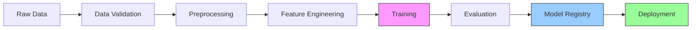

# ML Pipeline

## Pipeline Overview



## Data Management

### Dataset Structure
```python
class RxVisionDataset(Dataset):
    """Healthcare-grade image dataset with validation."""
    
    def __init__(
        self,
        data_dir: Path,
        transform: Optional[A.Compose] = None,
        validation: bool = True
    ):
        self.data_dir = data_dir
        self.transform = transform
        self.samples = self._load_samples()
        
        if validation:
            self._validate_dataset()
    
    def _validate_dataset(self) -> None:
        """Validate dataset integrity and quality."""
        for img_path, label in self.samples:
            # Image validation
            assert img_path.exists(), f"Missing image: {img_path}"
            img = Image.open(img_path)
            assert img.mode == "RGB", f"Invalid color mode: {img_path}"
            
            # Label validation
            assert label in self.valid_labels, f"Invalid label: {label}"
```

### Data Augmentation
```python
def create_transforms(
    img_size: tuple[int, int] = (224, 224),
    augment: bool = True
) -> dict[str, A.Compose]:
    """Create training and validation transforms."""
    train_transform = A.Compose([
        A.RandomResizedCrop(*img_size),
        A.HorizontalFlip(p=0.5),
        A.ShiftScaleRotate(p=0.5),
        A.ColorJitter(
            brightness=0.2,
            contrast=0.2,
            saturation=0.2,
            hue=0.1,
            p=0.5
        ),
        A.Normalize(),
        ToTensorV2(),
    ])
    
    val_transform = A.Compose([
        A.Resize(*img_size),
        A.Normalize(),
        ToTensorV2(),
    ])
    
    return {
        "train": train_transform,
        "val": val_transform
    }
```

## Model Architecture

### Backbone Selection
```python
class RxVisionBackbone(nn.Module):
    """Custom vision backbone with attention."""
    
    def __init__(
        self,
        base_model: str = "resnet50",
        pretrained: bool = True,
        freeze_layers: bool = True
    ):
        super().__init__()
        self.base = timm.create_model(
            base_model,
            pretrained=pretrained,
            features_only=True
        )
        
        if freeze_layers:
            self._freeze_base_layers()
        
        self.attention = SelfAttention(
            in_channels=2048,
            heads=8
        )
    
    def forward(self, x: Tensor) -> tuple[Tensor, Tensor]:
        """Forward pass with attention maps."""
        features = self.base(x)
        out, attention = self.attention(features[-1])
        return out, attention
```

### Training Configuration
```yaml
# configs/training.yaml
model:
  backbone: resnet50
  pretrained: true
  num_classes: 1000
  dropout: 0.3

training:
  batch_size: 32
  epochs: 100
  optimizer:
    name: AdamW
    lr: 1e-4
    weight_decay: 1e-5
  scheduler:
    name: CosineAnnealingWarmRestarts
    T_0: 10
    eta_min: 1e-6

data:
  img_size: [224, 224]
  augmentation: true
  num_workers: 4
```

## Training Pipeline

### Training Loop
```python
class RxVisionTrainer(pl.LightningModule):
    def training_step(
        self,
        batch: tuple[Tensor, Tensor],
        batch_idx: int
    ) -> dict[str, Tensor]:
        """Single training step with logging."""
        images, labels = batch
        
        # Forward pass
        logits, attention = self.model(images)
        loss = self.criterion(logits, labels)
        
        # Compute metrics
        accuracy = self.compute_accuracy(logits, labels)
        
        # Log metrics
        self.log("train/loss", loss)
        self.log("train/accuracy", accuracy)
        
        # Log attention maps periodically
        if batch_idx % 100 == 0:
            self._log_attention_maps(attention, images)
        
        return {"loss": loss, "accuracy": accuracy}
```

### Model Evaluation
```python
@torch.no_grad()
def evaluate_model(
    model: nn.Module,
    val_loader: DataLoader,
    metrics: list[Metric]
) -> dict[str, float]:
    """Comprehensive model evaluation."""
    model.eval()
    results = defaultdict(list)
    
    for images, labels in val_loader:
        # Forward pass
        logits = model(images)
        preds = logits.argmax(dim=1)
        
        # Update metrics
        for metric in metrics:
            metric.update(preds, labels)
    
    # Compute final metrics
    return {
        metric.name: metric.compute()
        for metric in metrics
    }
```

## Model Registry

### Version Control
```python
class ModelRegistry:
    def save_checkpoint(
        self,
        model: nn.Module,
        metrics: dict[str, float],
        metadata: dict[str, Any]
    ) -> str:
        """Save model checkpoint with metadata."""
        # Generate version
        version = self._generate_version()
        
        # Save model
        checkpoint = {
            "state_dict": model.state_dict(),
            "metrics": metrics,
            "metadata": metadata
        }
        
        path = self.save_dir / f"model-{version}.pt"
        torch.save(checkpoint, path)
        
        # Log to MLflow
        self._log_to_mlflow(checkpoint, version)
        
        return version
```

## Deployment Pipeline

### Model Optimization
```python
def optimize_model(
    model: nn.Module,
    sample_input: Tensor
) -> nn.Module:
    """Optimize model for production."""
    # TorchScript compilation
    script_model = torch.jit.script(model)
    
    # Quantization
    quantized_model = torch.quantization.quantize_dynamic(
        script_model,
        {nn.Linear, nn.Conv2d},
        dtype=torch.qint8
    )
    
    # ONNX export
    torch.onnx.export(
        quantized_model,
        sample_input,
        "model.onnx",
        opset_version=13
    )
    
    return quantized_model
```

### Serving Configuration
```yaml
# serving/config.yaml
model:
  version: latest
  batch_size: 32
  max_batch_latency: 100  # ms
  device: cuda

server:
  host: 0.0.0.0
  port: 8000
  workers: 4
  timeout: 30

monitoring:
  metrics_port: 9090
  profiling: true
```

## Related Documentation
- [[Model Architecture]]
- [[Training Process]]
- [[Performance Optimization]]
- [[Monitoring Setup]] 