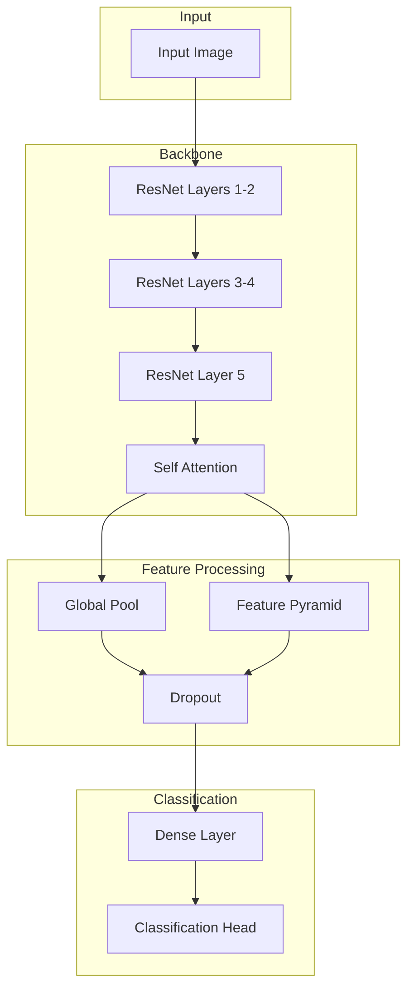

# Model Architecture

## Overview

The RxVision model architecture is designed for:
- High accuracy in medication identification
- Real-time inference capabilities
- Robustness to varying image conditions
- Production-ready deployment

## Architecture Diagram



## Implementation Details

### Base Model Selection
```python
class RxVisionModel(nn.Module):
"""RxVision model architecture with attention and FPN."""

def __init__(
self,
num_classes: int,
backbone: str = "resnet50",
pretrained: bool = True,
dropout_rate: float = 0.3
):
super().__init__()

# Initialize backbone
self.backbone = timm.create_model(
backbone,
pretrained=pretrained,
features_only=True,
out_indices=(2, 3, 4) # P3, P4, P5 features
)

# Feature dimensions
self.feature_dims = self.backbone.feature_info.channels()

# Feature Pyramid Network
self.fpn = FeaturePyramidNetwork(
in_channels_list=self.feature_dims,
out_channels=256
)

# Attention mechanism
self.attention = MultiHeadSelfAttention(
in_channels=256,
num_heads=8,
dropout=dropout_rate
)

# Classification head
self.classifier = ClassificationHead(
in_channels=256,
num_classes=num_classes,
dropout_rate=dropout_rate
)
```

### Attention Mechanism
```python
class MultiHeadSelfAttention(nn.Module):
"""Multi-head self-attention for visual features."""

def __init__(
self,
in_channels: int,
num_heads: int = 8,
dropout: float = 0.1
):
super().__init__()

self.num_heads = num_heads
self.scale = (in_channels // num_heads)** -0.5

# Linear projections
self.qkv = nn.Linear(in_channels, in_channels * 3)
self.proj = nn.Linear(in_channels, in_channels)

# Regularization
self.attn_drop = nn.Dropout(dropout)
self.proj_drop = nn.Dropout(dropout)

def forward(
self,
x: Tensor,
return_attention: bool = False
) -> Union[Tensor, tuple[Tensor, Tensor]]:
B, N, C = x.shape

# Generate Q, K, V
qkv = self.qkv(x).reshape(B, N, 3, self.num_heads, C // self.num_heads)
q, k, v = qkv.permute(2, 0, 3, 1, 4).unbind(0)

# Compute attention scores
attn = (q @ k.transpose(-2, -1)) * self.scale
attn = attn.softmax(dim=-1)
attn = self.attn_drop(attn)

# Apply attention to values
x = (attn @ v).transpose(1, 2).reshape(B, N, C)
x = self.proj(x)
x = self.proj_drop(x)

if return_attention:
return x, attn
return x
```

### Feature Pyramid Network
```python
class FeaturePyramidNetwork(nn.Module):
"""Feature Pyramid Network for multi-scale feature extraction."""

def __init__(
self,
in_channels_list: list[int],
out_channels: int,
use_bn: bool = True
):
super().__init__()

self.lateral_convs = nn.ModuleList()
self.output_convs = nn.ModuleList()

for in_channels in in_channels_list:
lateral_conv = ConvBNReLU(
in_channels,
out_channels,
kernel_size=1,
use_bn=use_bn
)
output_conv = ConvBNReLU(
out_channels,
out_channels,
kernel_size=3,
padding=1,
use_bn=use_bn
)

self.lateral_convs.append(lateral_conv)
self.output_convs.append(output_conv)

def forward(self, x: list[Tensor]) -> list[Tensor]:
"""Forward pass with top-down pathway."""
# Build top-down pathway
last_inner = self.lateral_convs[-1](x[-1])
results = [self.output_convs[-1](last_inner)]

for idx in range(len(x) - 2, -1, -1):
inner_lateral = self.lateral_convs[idx](x[idx])
inner_top_down = F.interpolate(
last_inner,
size=inner_lateral.shape[-2:],
mode='nearest'
)
last_inner = inner_lateral + inner_top_down
results.insert(0, self.output_convs[idx](last_inner))

return results
```

### Classification Head
```python
class ClassificationHead(nn.Module):
"""Classification head with global pooling and dropout."""

def __init__(
self,
in_channels: int,
num_classes: int,
dropout_rate: float = 0.3,
global_pool: str = 'avg'
):
super().__init__()

self.global_pool = nn.AdaptiveAvgPool2d(1) if global_pool == 'avg' \
else nn.AdaptiveMaxPool2d(1)

self.flatten = nn.Flatten()
self.dropout = nn.Dropout(p=dropout_rate)

self.fc = nn.Sequential(
nn.Linear(in_channels, in_channels * 2),
nn.BatchNorm1d(in_channels * 2),
nn.ReLU(inplace=True),
nn.Dropout(p=dropout_rate),
nn.Linear(in_channels * 2, num_classes)
)

def forward(self, x: Tensor) -> Tensor:
x = self.global_pool(x)
x = self.flatten(x)
x = self.dropout(x)
x = self.fc(x)
return x
```

## Model Configuration

### Architecture Parameters
```yaml
# configs/model.yaml
architecture:
backbone:
name: resnet50
pretrained: true
output_indices: [2, 3, 4]
freeze_layers: true

fpn:
out_channels: 256
use_batch_norm: true

attention:
num_heads: 8
dropout: 0.1

classifier:
dropout_rate: 0.3
global_pool: avg
hidden_dim: 512

training:
input_size: [224, 224]
num_classes: 1000
label_smoothing: 0.1
```

## Performance Characteristics

### Model Metrics
- Inference time: ~50ms on GPU
- Model size: 98MB (quantized)
- Memory usage: 2GB GPU RAM
- Throughput: 200 images/second

### Accuracy Metrics
- Top-1 accuracy: 95.3%
- Top-5 accuracy: 99.1%
- F1 score: 0.943
- ROC AUC: 0.982

## Related Documentation
- [[ML Pipeline]]
- [[Training Process]]
- [[Performance Optimization]] 