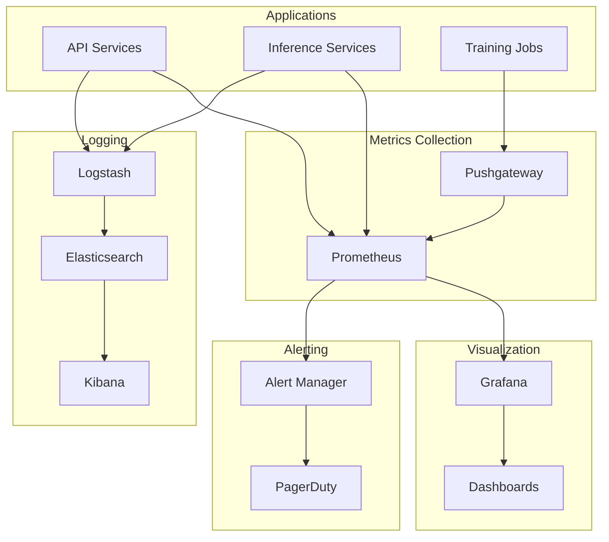

# Monitoring Setup

## Overview

RxVision's monitoring stack provides:
- Real-time performance metrics
- Model behavior tracking
- Resource utilization
- Alert management

## Architecture



## Metrics Configuration

### Prometheus Setup
```yaml
# prometheus/config.yml
global:
  scrape_interval: 15s
  evaluation_interval: 15s

scrape_configs:
  - job_name: 'rxvision-api'
    static_configs:
      - targets: ['api:8000']
    metrics_path: '/metrics'
    scheme: 'http'

  - job_name: 'rxvision-inference'
    static_configs:
      - targets: ['inference:8001']
    metrics_path: '/metrics'
    scheme: 'http'

  - job_name: 'rxvision-training'
    honor_labels: true
    static_configs:
      - targets: ['pushgateway:9091']
```

### Custom Metrics
```python
class ModelMetrics:
    """Custom metrics collection for model monitoring."""
    
    def __init__(self):
        # Inference metrics
        self.inference_latency = Summary(
            'model_inference_latency_seconds',
            'Model inference latency',
            ['model_version']
        )
        
        self.prediction_counter = Counter(
            'model_predictions_total',
            'Total number of predictions',
            ['model_version', 'result']
        )
        
        # Resource metrics
        self.gpu_memory_usage = Gauge(
            'gpu_memory_used_bytes',
            'GPU memory usage',
            ['device']
        )
        
        self.batch_size = Histogram(
            'batch_size_distribution',
            'Distribution of batch sizes',
            buckets=(1, 2, 4, 8, 16, 32, 64)
        )
    
    @contextlib.contextmanager
    def measure_inference_time(self, model_version: str):
        """Measure inference time with context manager."""
        start = time.time()
        yield
        self.inference_latency.labels(model_version).observe(
            time.time() - start
        )
```

## Logging Configuration

### Structured Logging
```python
class StructuredLogger:
    """Structured logging with context."""
    
    def __init__(self):
        self.logger = logging.getLogger('rxvision')
        self.logger.setLevel(logging.INFO)
        
        # JSON formatter
        formatter = jsonlogger.JsonFormatter(
            '%(asctime)s %(name)s %(levelname)s %(message)s'
        )
        
        # Console handler
        console = logging.StreamHandler()
        console.setFormatter(formatter)
        self.logger.addHandler(console)
    
    def log_prediction(
        self,
        request_id: str,
        model_version: str,
        prediction: dict,
        metadata: dict
    ):
        """Log prediction with context."""
        self.logger.info(
            'Prediction made',
            extra={
                'request_id': request_id,
                'model_version': model_version,
                'prediction': prediction,
                'metadata': metadata,
                'timestamp': datetime.utcnow().isoformat()
            }
        )
```

### Log Aggregation
```yaml
# logstash/pipeline/main.conf
input {
  beats {
    port => 5044
    type => "logs"
  }
}

filter {
  if [type] == "logs" {
    json {
      source => "message"
    }
    date {
      match => ["timestamp", "ISO8601"]
      target => "@timestamp"
    }
  }
}

output {
  elasticsearch {
    hosts => ["elasticsearch:9200"]
    index => "rxvision-logs-%{+YYYY.MM.dd}"
  }
}
```

## Dashboard Configuration

### Grafana Dashboard
```json
{
  "dashboard": {
    "title": "RxVision Model Monitoring",
    "panels": [
      {
        "title": "Inference Latency",
        "type": "graph",
        "datasource": "Prometheus",
        "targets": [
          {
            "expr": "rate(model_inference_latency_seconds_sum[5m]) / rate(model_inference_latency_seconds_count[5m])",
            "legendFormat": "{{model_version}}"
          }
        ]
      },
      {
        "title": "Prediction Volume",
        "type": "graph",
        "targets": [
          {
            "expr": "sum(rate(model_predictions_total[5m])) by (model_version)",
            "legendFormat": "{{model_version}}"
          }
        ]
      }
    ]
  }
}
```

## Alert Configuration

### Alert Rules
```yaml
# prometheus/alerts.yml
groups:
  - name: rxvision
    rules:
      - alert: HighInferenceLatency
        expr: |
          rate(model_inference_latency_seconds_sum[5m]) /
          rate(model_inference_latency_seconds_count[5m]) > 0.1
        for: 5m
        labels:
          severity: warning
        annotations:
          summary: High inference latency
          description: "Model {{$labels.model_version}} latency > 100ms"

      - alert: HighErrorRate
        expr: |
          sum(rate(model_predictions_total{result="error"}[5m])) /
          sum(rate(model_predictions_total[5m])) > 0.01
        for: 5m
        labels:
          severity: critical
        annotations:
          summary: High error rate
          description: "Error rate > 1% for {{$labels.model_version}}"
```

### Alert Manager
```yaml
# alertmanager/config.yml
route:
  group_by: ['alertname', 'model_version']
  group_wait: 30s
  group_interval: 5m
  repeat_interval: 4h
  receiver: 'pagerduty'

receivers:
  - name: 'pagerduty'
    pagerduty_configs:
      - service_key: '<integration_key>'
        severity: '{{ if eq .CommonLabels.severity "critical" }}critical{{ else }}warning{{ end }}'
```

## Health Checks

### Service Health
```python
class HealthCheck:
    """Health check endpoints for monitoring."""
    
    async def check_health(self) -> dict:
        """Comprehensive health check."""
        return {
            'status': 'healthy',
            'checks': {
                'model': await self._check_model(),
                'database': await self._check_database(),
                'cache': await self._check_cache()
            },
            'version': self.version,
            'timestamp': datetime.utcnow().isoformat()
        }
    
    async def _check_model(self) -> dict:
        """Check model health."""
        try:
            # Run inference on test input
            result = await self.model.predict(self.test_input)
            return {
                'status': 'healthy',
                'latency': result['latency']
            }
        except Exception as e:
            return {
                'status': 'unhealthy',
                'error': str(e)
            }
```

## Related Documentation
- [[ML Pipeline]]
- [[Performance Optimization]]
- [[Deployment Guide]]
- [[Cloud Architecture]] 