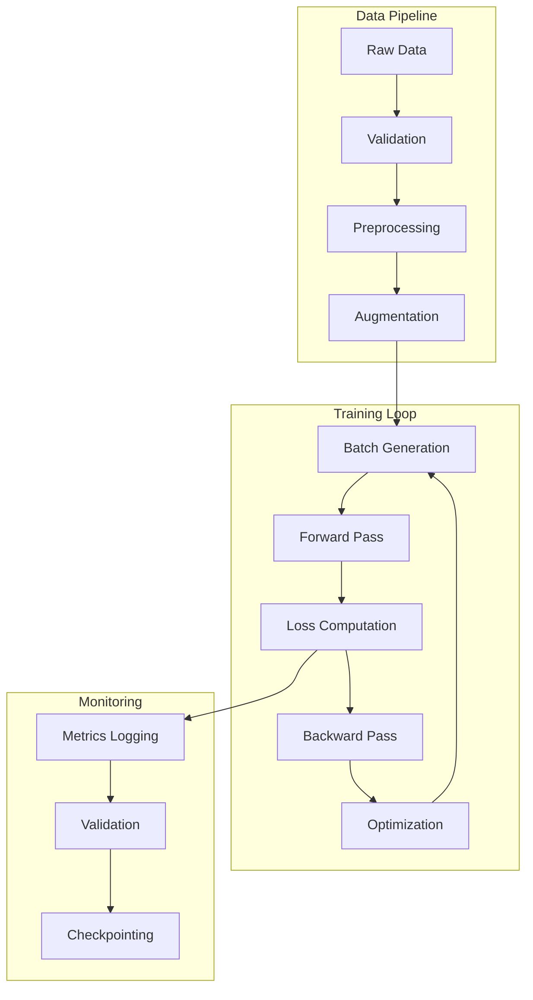

# Training Process

## Overview

The RxVision training process is designed for:
- Reproducible results
- Efficient resource utilization
- Experiment tracking
- Production-ready models

## Training Pipeline



## Training Configuration

### Hyperparameters
```yaml
# configs/training.yaml
training:
  # Basic parameters
  epochs: 100
  batch_size: 32
  num_workers: 4
  
  # Optimization
  optimizer:
    name: AdamW
    lr: 1e-4
    weight_decay: 1e-5
    gradient_clip: 1.0
    
  # Learning rate schedule
  scheduler:
    name: CosineAnnealingWarmRestarts
    T_0: 10
    T_mult: 2
    eta_min: 1e-6
    
  # Loss configuration
  loss:
    name: CrossEntropyLoss
    label_smoothing: 0.1
    class_weights: balanced
    
  # Regularization
  augmentation:
    enabled: true
    strength: medium
  mixup:
    enabled: true
    alpha: 0.2
  
  # Hardware
  precision: 16  # mixed precision
  accelerator: gpu
  devices: [0, 1]  # multi-GPU
  strategy: ddp  # distributed training
```

## Training Implementation

### Training Loop
```python
class RxVisionTrainer(pl.LightningModule):
    def __init__(self, config: DictConfig):
        super().__init__()
        self.save_hyperparameters(config)
        self.setup_model()
        self.setup_loss()
        self.setup_metrics()
        
    def training_step(
        self,
        batch: tuple[Tensor, Tensor],
        batch_idx: int
    ) -> dict[str, Tensor]:
        """Execute single training step with logging."""
        images, labels = batch
        
        # Apply mixup augmentation
        if self.hparams.training.mixup.enabled:
            images, labels_a, labels_b, lam = mixup_batch(
                images,
                labels,
                alpha=self.hparams.training.mixup.alpha
            )
        
        # Forward pass with automatic mixed precision
        with torch.cuda.amp.autocast(enabled=self.hparams.training.precision == 16):
            logits = self.model(images)
            
            # Compute loss
            loss = self.criterion(logits, labels) if not self.hparams.training.mixup.enabled \
                else mixup_criterion(self.criterion, logits, labels_a, labels_b, lam)
        
        # Compute metrics
        metrics = self.compute_metrics(logits, labels)
        metrics['loss'] = loss
        
        # Log metrics
        self.log_dict(
            {f"train/{k}": v for k, v in metrics.items()},
            on_step=True,
            on_epoch=True,
            prog_bar=True
        )
        
        return loss
```

### Validation Process
```python
def validation_step(
    self,
    batch: tuple[Tensor, Tensor],
    batch_idx: int
) -> dict[str, Tensor]:
    """Execute validation step with comprehensive metrics."""
    images, labels = batch
    
    # Forward pass
    logits = self.model(images)
    loss = self.criterion(logits, labels)
    
    # Compute metrics
    metrics = self.compute_metrics(logits, labels)
    metrics['loss'] = loss
    
    # Log metrics
    self.log_dict(
        {f"val/{k}": v for k, v in metrics.items()},
        on_epoch=True,
        prog_bar=True
    )
    
    # Log sample predictions periodically
    if batch_idx % 100 == 0:
        self._log_predictions(images, labels, logits)
    
    return metrics
```

## Experiment Tracking

### MLflow Configuration
```python
def setup_tracking(config: DictConfig) -> None:
    """Configure MLflow experiment tracking."""
    mlflow.set_tracking_uri(config.tracking.uri)
    mlflow.set_experiment(config.tracking.experiment)
    
    # Log configuration
    mlflow.log_params(OmegaConf.to_container(config))
    
    # Log dependencies
    mlflow.log_artifact("requirements.txt")
    
    # Log code version
    repo = git.Repo(search_parent_directories=True)
    mlflow.log_param("commit_hash", repo.head.object.hexsha)
```

### Metric Logging
```python
def log_metrics(
    metrics: dict[str, float],
    step: int,
    prefix: str = ""
) -> None:
    """Log metrics to MLflow with proper formatting."""
    formatted_metrics = {
        f"{prefix}/{k}" if prefix else k: v
        for k, v in metrics.items()
    }
    
    mlflow.log_metrics(formatted_metrics, step=step)
```

## Model Selection

### Early Stopping
```python
early_stopping = EarlyStopping(
    monitor='val/loss',
    patience=10,
    mode='min',
    min_delta=1e-4,
    verbose=True
)
```

### Model Checkpointing
```python
checkpoint_callback = ModelCheckpoint(
    dirpath='checkpoints',
    filename='rxvision-{epoch:02d}-{val_loss:.4f}',
    monitor='val/loss',
    mode='min',
    save_top_k=3,
    save_last=True,
    auto_insert_metric_name=False
)
```

## Performance Optimization

### Mixed Precision Training
```python
trainer = pl.Trainer(
    precision=16,  # Enable AMP
    accelerator='gpu',
    devices=[0, 1],
    strategy='ddp',
    callbacks=[early_stopping, checkpoint_callback],
    logger=mlflow_logger,
    max_epochs=100
)
```

### Memory Optimization
```python
def configure_optimizers(self):
    """Configure optimizer with gradient clipping."""
    optimizer = torch.optim.AdamW(
        self.parameters(),
        lr=self.hparams.training.optimizer.lr,
        weight_decay=self.hparams.training.optimizer.weight_decay
    )
    
    # Gradient clipping
    for param in self.parameters():
        if param.requires_grad:
            param.register_hook(
                lambda grad: torch.nn.utils.clip_grad_norm_(
                    grad,
                    self.hparams.training.optimizer.gradient_clip
                )
            )
    
    return optimizer
```

## Related Documentation
- [[ML Pipeline]]
- [[Model Architecture]]
- [[Performance Optimization]] 